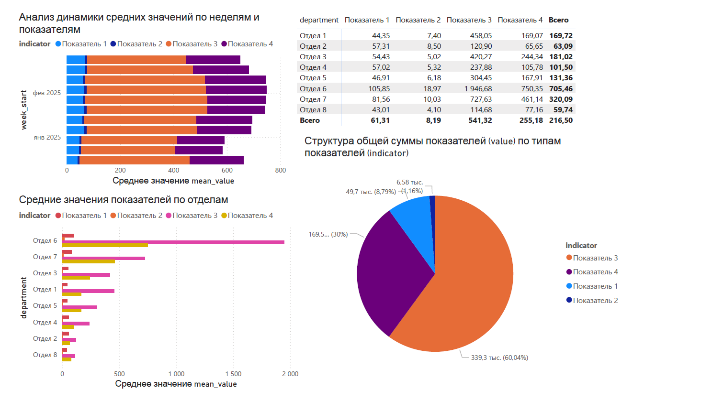

# Аналитика KPI сотрудников (EDA + Power BI)

Небольшой pet-project по анализу KPI сотрудников по отделам и неделям.  
Цель - понять распределения показателей, сравнить отделы, найти выбросы/аномалии и посмотреть динамику во времени.  
Результат оформлен в виде ноутбука с EDA и Power BI дашборда (PDF).

---

## Что сделано
- Подготовка данных: приведение формата, преобразование в “long”, перевод значений в числовой тип  
- Описательная статистика: средние/медианы по связке **отдел × показатель**  
- Поиск выбросов и “нетипичных” отделов/недель (boxplot, распределения)  
- Анализ динамики: изменения показателей по неделям, участки роста/падения  
- Проверка взаимосвязей: корреляционная матрица  
- Визуализация результата в Power BI (экспорт в PDF)

---

## Дашборд (превью)


PDF-версия: `reports/dashboard.pdf`

---

## Структура репозитория
- `notebooks/kpi_eda.ipynb` — ноутбук с анализом (EDA)  
- `reports/dashboard.pdf` — Power BI dashboard (экспорт)  
- `reports/figures/` — изображения для README  
- `data/raw/` — место для исходных данных 

---

## Как запустить проект

1) Установить зависимости:
```bash
pip install -r requirements.txt
```
2) Запустить Jupyter:
```bash
jupyter lab
```
3) Открыть ноутбук:
`notebooks/kpi_eda.ipynb`

---

## Данные
Исходные данные: `employee_id`, `department`, `indicator`, а также колонки со значениями KPI по неделям.

---

## О проекте
Проект показывает полный цикл базовой аналитики KPI: подготовка данных, расчёт ключевых статистик, поиск выбросов и анализ динамики по неделям. Итоговые результаты дополнительно визуализированы в Power BI.

---

## Основные результаты
- Сравнение KPI между отделами и выявление отделов, которые заметно отклоняются от остальных
- Анализ распределений показателей и “нетипичных” значений
- Динамика KPI по неделям и точки роста/падения
- Проверка взаимосвязей между показателями

---

## Где смотреть результаты
- Ноутбук с анализом: `notebooks/kpi_eda.ipynb`
- Дашборд (PDF): `reports/dashboard.pdf`

---

## Идеи для улучшения (roadmap)
- Автоматическое выявление аномалий (IQR / z-score) и метки “аномальная неделя/отдел”
- Выгрузка итогового отчёта из ноутбука в HTML/PDF
- Вынос повторяющихся функций в `src/` и добавление тестов
- Публикация дашборда (Power BI Service) или интерактивный отчёт на Streamlit

---
